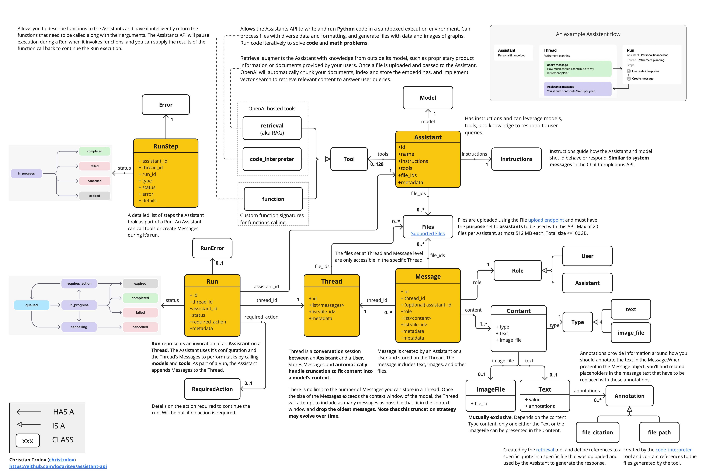

# Java Client for OpenAI Assistant API

The `assistant-api` is a lightweight, Java client implementation of the `Assistants`  (Assistants, Threads, Messages, Runs, RunSteps) and the `Files` OpenAI APIs.

Follow the [quick start](#2-quick-start) guide to learn how to use the `assistant-api` for building a sample Assistant [application](src/test/java/com/logaritex/ai/api/samples/AssistantOverview.java).

The [Sample Assistant Applications](#3-sample-assistant-applications) section, offers more in-depth  examples, exploring the important Assistants features: [OpenAiFunctionTool.java](src/test/java/com/logaritex/ai/api/samples/function/OpenAiFunctionTool.java), [KnowledgeRetrievalAssistant.java](src/test/java/com/logaritex/ai/api/samples/retrieval/KnowledgeRetrievalAssistant.java), [FintechCodeInterpreterTool.java](src/test/java/com/logaritex/ai/api/samples/codeinterpreter/FintechCodeInterpreterTool.java), [SimpleAssistantWithDefaults.java](src/test/java/com/logaritex/ai/api/samples/SimpleAssistantWithDefaults.java).

> **Tip:**  With the [Playground UI](https://platform.openai.com/playground) you can explore and manage and reuse the Assistant objects & Files created in your `assistant-api` applications.

## 1. Assistant API Concepts

The Assistants API simplifies the development of AI assistants apps.
It removes the need to manage conversation history and adds access to OpenAI-hosted tools like `Code Interpreter`, `Retrieval` (aka RAG) and 3rd party `Function-Calling`.
Following, annotated, diagram introduces the core API classes and their relationships:
> **Tip:** the [AssistantApi-Concepts.pdf](./docs/AssistantApi-Concepts.pdf) version of the diagram offers (clickable) links to the OpenAI reference documentation.



Some of benefits offered by the Assistants API are:

- You don't have to store Messages in your own DB.
- OpenAI handles truncating Messages to fit the context window for you (e.g. hosted RAG implementation).
- The model output is generated even if you're disconnected from the API (e.g. the Run is asynchronous).
- You always can retrieve the Messages later as they're persisted in the Thread.

## 2. Quick Start

### Prerequisites

OpenAI Account: Create an account at [OpenAI Signup](https://platform.openai.com/signup) and generate the token at [API Keys](https://platform.openai.com/account/api-keys).

### Dependencies

Add the maven `assistant-api` dependency:

```xml
<dependency>
   <groupId>com.logaritex.ai</groupId>
   <artifactId>assistant-api</artifactId>
   <version>0.1.0-SNAPSHOT</version>
</dependency>
```

> **Note:** currently you need to [clone and build](#4-how-to-build) the repo.

### Create the Clients

Create new `AssistantApi` and `FileApi` client instances, using your OpenAI API-KEY.

```java
// Connect to the assistant-api using your OpenAI api key.
AssistantApi assistantApi = new AssistantApi("<YOUR OPENAI API-KEY>");

// Connect to the file-api using your OpenAI api key.
FileApi fileApi = new FileApi("<YOUR OPENAI API-KEY>");
```

### Create an Assistant

The `Assistant` has instructions and can leverage models, tools, and knowledge to respond to user queries.

In this example, we're creating an Assistant that is a personal math tutor, with the Code Interpreter tool enabled:

```java

// Create a Math Tutor assistant.
Data.Assistant assistant = assistantApi.createAssistant(new AssistantRequestBody(
   "gpt-4-1106-preview", // model
   "Math Tutor", // name
   "", // description
   "You are a personal math tutor. Write and run code to answer math questions.", // instructions
   List.of(new Tool(Tool.Type.code_interpreter)), // tools
   List.of(), // file ids
   Map.of())); // metadata
```

- `Instructions`: instructs how the Assistant and model should behave or respond (Similar to system messages in the Chat Completions API).
- `Model`: the LLM model to use.
- `Code Interpreter`: one of the supported tools, that allows the Assistants to write and run Python code in a sandboxed execution environment to solve code and math problems.

### Create a Thread

`Thread` is a, persistent, conversation session between an `Assistant` and a `User`. It stores `Messages` and automatically handle truncation to fit content into a model’s context.

Threads are created per user, after the user initiates the conversation.

```java
// Create an empty Thread.
Data.Thread thread = assistantApi.createThread(new ThreadRequest<>());
```

### Add a Message to a Thread

`Message` is created by an `Assistant` or a `User` and stored on the `Thread`. It can include text, images, and other files.

Lets add a new user Message to our Thread:

```java
assistantApi.createMessage(new MessageRequest(
   Role.user, // user created message.
   "I need to solve the equation `3x + 11 = 14`. Can you help me?"), // user question.
   thread.id()); // thread to add the message to.
```

Threads don’t have a size limit. You can add as many Messages as you want to a Thread. The Assistant will ensure that requests to the model fit within the maximum context window, using relevant optimization techniques.

### Run the Assistant

The `Run` represents the execution of a `Thread` with an `Assistant`.
For the `Assistant` to respond to the user message, you need to create a `Run`. This makes the Assistant read the `Thread` and decide whether to call tools (if they are enabled) or simply use the model to best answer the query. As the run progresses, the assistant appends `Messages` to the thread with the `"assistant"` role. The Assistant automatically decides what previous Messages to include in the context window for the model.

Here is how to create a new Run for a Thread with an Assistant:

```java
Data.Run run = assistantApi.createRun(
   thread.id(), // run this thread,
   new RunRequest(assistant.id())); // with this assistant.
```

### Check the Run status

By default, a Run goes into the queued state. You can periodically retrieve the Run to check on its status to see if it has moved to completed:

```java
while (assistantApi.retrieveRun(thread.id(), run.id()).status() != Run.Status.completed) {
   java.lang.Thread.sleep(500);
}
```

> **Tip:** The [Assistant API Concepts](#1-assistant-api-concepts) diagram shows the supported Run states and state transitions.

### Display the Assistant's Response

Once the Run completes, you can list the Messages added to the Thread by the Assistant:

```java
DataList<Message> messages = assistantApi.listMessages(
 new ListRequest(), thread.id());

// Filter out the assistant messages only.
List<Message> assistantMessages = messages.data().stream()
   .filter(msg -> msg.role() == Role.assistant).toList();
```

During this Run, the Assistant added new Message to the Thread.
Here is an example of what that message might look like:

```json
{
  "id" : "msg_Axjj7SfuCdSa3S7Te5UVzCZB",
  "object" : "thread.message",
  "created_at" : 1701034742,
  "thread_id" : "thread_9MLO5QD8TahGFlIe1VNP0UdO",
  "role" : "assistant",
  "content" : [ {
    "type" : "text",
    "text" : {
      "value" : "To solve the equation \\(3x + 11 = 14\\), subtract 11 from both sides to get \\(3x = 3\\). Then divide both sides by 3 to solve for \\(x\\), which gives us \\(x = 1\\).",
      "annotations" : [ ]
    }
  } ],
  "assistant_id" : "asst_tRvOf7E30NIpBdzhMLeKmeaC",
  "run_id" : "run_BZw1S4ZQ3qyotbipOvtwtbJ7",
  "file_ids" : [ ],
  "metadata" : { }
}
```

> You can also retrieve the Run Steps of this Run if you'd like to explore or display the inner workings of the Assistant and its tools.

Here is the complete [AssistantOverview.java](src/test/java/com/logaritex/ai/api/samples/AssistantOverview.java) code.

## 3. Sample Assistant Applications

Following examples demonstrate how to use the `assistant-api` library to leverage the various Assistants API features.

### 3.1 Knowledge Retrieval Tool

The [KnowledgeRetrievalAssistant.java](src/test/java/com/logaritex/ai/api/samples/retrieval/KnowledgeRetrievalAssistant.java) demo creates an Assistant instructed to behave as a SpringBoot expert.
The `Retrieval Tool` is enabled to augment the Assistant with knowledge from outside its model, such as the latest [spring-boot-reference.pdf](src/test/resources/spring-boot-reference.pdf) documentation.
Once the doc files are uploaded and passed to the Assistant, OpenAI automatically chunks the documents, index and store the embeddings, and implement vector search to retrieve relevant content to answer user queries.

The  KnowledgeRetrievalAssistant creates a Thread and an user message with a question about information available only in the attached reference document.
Then it creates a Run to execute the Tread with the configured Assistant.
After the execution completes the demo retrieves the Assistant generated message (e.g. the answer) and prints the text content.
For further details, follow the inlined logging messages.

N.B. The [Retrieval Tool](https://platform.openai.com/docs/assistants/tools/knowledge-retrieval) is a proprietary, hosted, OpenAI [RAG](https://research.ibm.com/blog/retrieval-augmented-generation-RAG) implementation with somewhat limited configuration options at the moment:
> Retrieval currently optimizes for quality by adding all relevant content to the context of model calls.
> We plan to introduce other retrieval strategies to enable developers to choose a different tradeoff between retrieval quality and model usage cost.

> (The KnowledgeRetrievalAssistant was inspired by this [video](https://youtu.be/pq34V_V5j18?t=2014)).

### 3.2 Code Interpreter Tool

The [FintechCodeInterpreterTool.java](src/test/java/com/logaritex/ai/api/samples/codeinterpreter/FintechCodeInterpreterTool.java) demo creates an Assistant instructed to behave as a financial expert and `help users with finance and stock exchange questions`.
The [Code Interpreter](https://platform.openai.com/docs/assistants/tools/code-interpreter) is enabled to allow the Assistant write and run Python code in a sandboxed execution environment, process diverse data formats, and generate data and images, to solve code and math problems.
Also a `MSFT.csv` file,  with Microsoft's stock closing values, is upload and assigned to the fintech assistant.
Then the demo creates a Thread and user massage asking the assistant to `generate a chart showing the MSFT stock value changing over time`.
After the Run execution complete, the final assistance messages (e.g. `messageList.first_id()` ) is retrieved from the thread:

```json
    {
      "id": "msg_FbczWI9TjlRzlfo4hSFTzvFe",
      "object": "thread.message",
      "created_at": 1701189080,
      "thread_id": "thread_r2Juw5atbn8PxUY2BShsKdoo",
      "role": "assistant",
      "content": [
        {
          "type": "image_file",
          "image_file": {
            "file_id": "file-1ebZ3aCUuvaDTlIEeTjWpQeC"
          }
        },
        {
          "type": "text",
          "text": {
            "value": "Here is the chart showing the MSFT stock closing price changing over time, based on the data from the provided CSV file. You can see the trend of the stock price on this graph. If you need more details or further analysis, feel free to ask!",
            "annotations": []
          }
        }
      ],
      "file_ids": [],
      "assistant_id": "asst_Sp2SDnJju4seJtuzMhYPmD6B",
      "run_id": "run_PKSStrIChDGM52NozOgpPTOd",
      "metadata": {}
    }
```

Next the FintechCodeInterpreterTool retrieves the content of the Assistant generated `image_file` and stores it as a `msft-chart.png`:

For further details, follow the inlined logging messages.

> (The FintechCodeInterpreterTool was inspired by this [video](https://youtu.be/pq34V_V5j18?t=1734)).

The [AssistantOverview](src/test/java/com/logaritex/ai/api/samples/AssistantOverview.java) used in the quick start guide provides another, simpler, code-interpreter example.

### 3.3 Function Calling Tool

The [OpenAiFunctionTool.java](src/test/java/com/logaritex/ai/api/samples/function/OpenAiFunctionTool.java) demo creates an Assistant enabled with the [Function Tool](https://platform.openai.com/docs/assistants/tools/function-calling) to allow the users to define functions, prompting intelligent retrieval of required function calls and their arguments, with the API pausing execution during a Run for function invocation, allowing users to provide function call results to resume the Run.

The OpenAiFunctionTool defines two functions: (1) `getCurrentWeather` with a prompt to `Get the weather in location` and (2) `getCityLocalNames` with a prompt `Get the local names of a city`.
It also implements the [WeatherFunction.java](src/test/java/com/logaritex/ai/api/samples/function/WeatherFunction.java) and [CityNameFunction.java](src/test/java/com/logaritex/ai/api/samples/function/CityNameFunction.java) to handle the callbacks from the assistant using the defined parameter format.

Next the OpenAiFunctionTool creates an empty Thread and an user message that should trigger the Model to invoke the registered functions.
Start a Run with the thread and listen for run status: `Run.Status.requires_action`.
Later is indication that the Assistant is paused and waiting for you to call your custom functions and send the result back.

Finally the assistant generates an answer of the user question using the function responses.

## 4. How to build

```bash
git clone git@github.com:logaritex/assistant-api.git
```

```bash
./mvnw clean install
```

## 5. References

- [Assistants Overview](https://platform.openai.com/docs/assistants/overview)
- [How Assistants work](https://platform.openai.com/docs/assistants/how-it-works)
- [Assistants Tools](https://platform.openai.com/docs/assistants/tools)
- API References:
  - [Assistants](https://platform.openai.com/docs/api-reference/assistants)
  - [Threads](https://platform.openai.com/docs/api-reference/threads)
  - [Messages](https://platform.openai.com/docs/api-reference/messages)
  - [Runs](https://platform.openai.com/docs/api-reference/runs)
  - [Files](https://platform.openai.com/docs/api-reference/files)
- [Video demoing the knowledge retrieval tool](https://youtu.be/pq34V_V5j18?t=2014).
- [Video demoing the code interpreter tool](https://youtu.be/pq34V_V5j18?t=1734).
